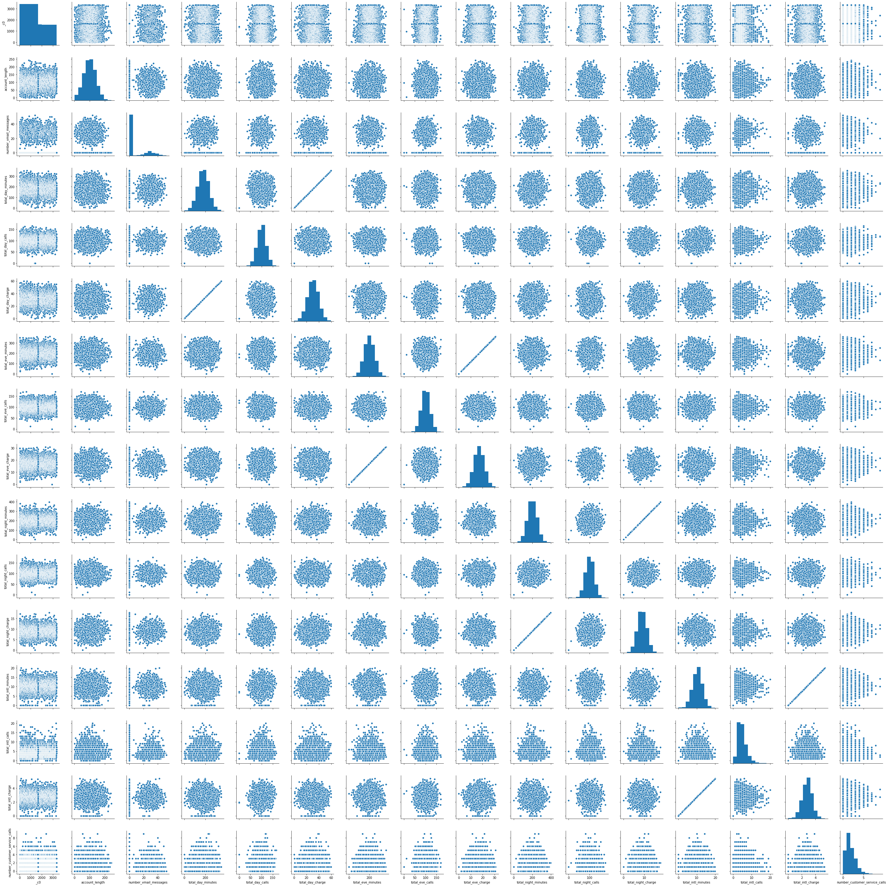
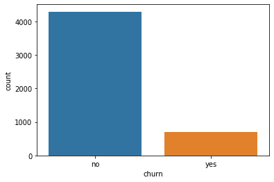

**LinkedIn**: https://www.linkedin.com/in/matheusjerico

---

# Prevendo Customer Churn em Operadoras de Telecom

## O que é Customer Churn?
Customer Churn (ou Rotatividade de Clientes, em uma tradução livre)
refere-se a uma decisão tomada pelo cliente sobre o término do relacionamento
comercial. Refere-se também à perda de clientes. A fidelidade do cliente e a
rotatividade de clientes sempre somam 100%. Se uma empresa tem uma taxa de
fidelidade de 60%, então a taxa de perda de clientes é de 40%. De acordo com a
regra de lucratividade do cliente 80/20, 20% dos clientes estão gerando 80% da
receita. Portanto, é muito importante prever os usuários que provavelmente
abandonarão o relacionamento comercial e os fatores que afetam as decisões do
cliente.

## Dataset
Os datasets de treino e de teste estão no repositório. O cabeçalho do dataset é uma descrição do tipo de informação em cada coluna.

### 1. Importando bibliotecas


```python
from pyspark.sql import Row
from pyspark.ml.feature import VectorAssembler, PCA, StringIndexer
from pyspark.sql.types import FloatType
from pyspark.ml.classification import GBTClassifier, RandomForestClassifier
from pyspark.ml.evaluation import MulticlassClassificationEvaluator
from pyspark.ml import Pipeline
from pyspark.ml.feature import StringIndexer, StandardScaler, VectorAssembler
from pyspark.ml.tuning import CrossValidator, ParamGridBuilder
from sklearn.metrics import  classification_report, roc_auc_score, confusion_matrix
import numpy as np
import pandas as pd
import seaborn as sns
```


```python
pd.set_option('display.max_columns', 500)
```

### 2. Criando Session


```python
spSession = SparkSession.builder.master("local").appName("SparkChurn").getOrCreate()
```

### 3. Carregando dados


```python
dataset_train = spSession.read.load("./dados/projeto4_telecom_treino.csv",
                                  format = "csv",
                                  sep = ",",
                                  inferSchema = "true",
                                  header = "true")
dataset_test = spSession.read.load("./dados/projeto4_telecom_teste.csv",
                                  format = "csv",
                                  sep = ",",
                                  inferSchema = "true",
                                  header = "true")
```

### 4. Concatenando os dados


```python
print("Dataset Treino\nQuantidade de linhas: {}\nQuantidade de colunas: {}".format(dataset_train.count(), len(dataset_train.columns)))
```

    Dataset Treino
    Quantidade de linhas: 3333
    Quantidade de colunas: 21


```python
print("Dataset Teste\nQuantidade de linhas: {}\nQuantidade de colunas: {}".format(dataset_test.count(), len(dataset_test.columns)))
```

    Dataset Teste
    Quantidade de linhas: 1667
    Quantidade de colunas: 21


```python
dataset = dataset_train.unionAll(dataset_test)
```


```python
print("Dataset\nQuantidade de linhas: {}\nQuantidade de colunas: {}".format(dataset.count(), len(dataset.columns)))
```

    Dataset
    Quantidade de linhas: 5000
    Quantidade de colunas: 21


### 5. Overview


```python
dataset.printSchema()
```

    root
     |-- _c0: integer (nullable = true)
     |-- state: string (nullable = true)
     |-- account_length: integer (nullable = true)
     |-- area_code: string (nullable = true)
     |-- international_plan: string (nullable = true)
     |-- voice_mail_plan: string (nullable = true)
     |-- number_vmail_messages: integer (nullable = true)
     |-- total_day_minutes: double (nullable = true)
     |-- total_day_calls: integer (nullable = true)
     |-- total_day_charge: double (nullable = true)
     |-- total_eve_minutes: double (nullable = true)
     |-- total_eve_calls: integer (nullable = true)
     |-- total_eve_charge: double (nullable = true)
     |-- total_night_minutes: double (nullable = true)
     |-- total_night_calls: integer (nullable = true)
     |-- total_night_charge: double (nullable = true)
     |-- total_intl_minutes: double (nullable = true)
     |-- total_intl_calls: integer (nullable = true)
     |-- total_intl_charge: double (nullable = true)
     |-- number_customer_service_calls: integer (nullable = true)
     |-- churn: string (nullable = true)
    


```python
dataset.toPandas().head()
```


<div>
<style scoped>
    .dataframe tbody tr th:only-of-type {
        vertical-align: middle;
    }

    .dataframe tbody tr th {
        vertical-align: top;
    }

    .dataframe thead th {
        text-align: right;
    }
</style>
<table border="1" class="dataframe">
  <thead>
    <tr style="text-align: right;">
      <th></th>
      <th>_c0</th>
      <th>state</th>
      <th>account_length</th>
      <th>area_code</th>
      <th>international_plan</th>
      <th>voice_mail_plan</th>
      <th>number_vmail_messages</th>
      <th>total_day_minutes</th>
      <th>total_day_calls</th>
      <th>total_day_charge</th>
      <th>total_eve_minutes</th>
      <th>total_eve_calls</th>
      <th>total_eve_charge</th>
      <th>total_night_minutes</th>
      <th>total_night_calls</th>
      <th>total_night_charge</th>
      <th>total_intl_minutes</th>
      <th>total_intl_calls</th>
      <th>total_intl_charge</th>
      <th>number_customer_service_calls</th>
      <th>churn</th>
    </tr>
  </thead>
  <tbody>
    <tr>
      <td>0</td>
      <td>1</td>
      <td>KS</td>
      <td>128</td>
      <td>area_code_415</td>
      <td>no</td>
      <td>yes</td>
      <td>25</td>
      <td>265.1</td>
      <td>110</td>
      <td>45.07</td>
      <td>197.4</td>
      <td>99</td>
      <td>16.78</td>
      <td>244.7</td>
      <td>91</td>
      <td>11.01</td>
      <td>10.0</td>
      <td>3</td>
      <td>2.70</td>
      <td>1</td>
      <td>no</td>
    </tr>
    <tr>
      <td>1</td>
      <td>2</td>
      <td>OH</td>
      <td>107</td>
      <td>area_code_415</td>
      <td>no</td>
      <td>yes</td>
      <td>26</td>
      <td>161.6</td>
      <td>123</td>
      <td>27.47</td>
      <td>195.5</td>
      <td>103</td>
      <td>16.62</td>
      <td>254.4</td>
      <td>103</td>
      <td>11.45</td>
      <td>13.7</td>
      <td>3</td>
      <td>3.70</td>
      <td>1</td>
      <td>no</td>
    </tr>
    <tr>
      <td>2</td>
      <td>3</td>
      <td>NJ</td>
      <td>137</td>
      <td>area_code_415</td>
      <td>no</td>
      <td>no</td>
      <td>0</td>
      <td>243.4</td>
      <td>114</td>
      <td>41.38</td>
      <td>121.2</td>
      <td>110</td>
      <td>10.30</td>
      <td>162.6</td>
      <td>104</td>
      <td>7.32</td>
      <td>12.2</td>
      <td>5</td>
      <td>3.29</td>
      <td>0</td>
      <td>no</td>
    </tr>
    <tr>
      <td>3</td>
      <td>4</td>
      <td>OH</td>
      <td>84</td>
      <td>area_code_408</td>
      <td>yes</td>
      <td>no</td>
      <td>0</td>
      <td>299.4</td>
      <td>71</td>
      <td>50.90</td>
      <td>61.9</td>
      <td>88</td>
      <td>5.26</td>
      <td>196.9</td>
      <td>89</td>
      <td>8.86</td>
      <td>6.6</td>
      <td>7</td>
      <td>1.78</td>
      <td>2</td>
      <td>no</td>
    </tr>
    <tr>
      <td>4</td>
      <td>5</td>
      <td>OK</td>
      <td>75</td>
      <td>area_code_415</td>
      <td>yes</td>
      <td>no</td>
      <td>0</td>
      <td>166.7</td>
      <td>113</td>
      <td>28.34</td>
      <td>148.3</td>
      <td>122</td>
      <td>12.61</td>
      <td>186.9</td>
      <td>121</td>
      <td>8.41</td>
      <td>10.1</td>
      <td>3</td>
      <td>2.73</td>
      <td>3</td>
      <td>no</td>
    </tr>
  </tbody>
</table>
</div>


```python
sns.pairplot(dataset.toPandas())
```


    <seaborn.axisgrid.PairGrid at 0x7f2fc23a1d50>





```python
datasetPandas = dataset.toPandas()
sns.countplot(datasetPandas['churn'])
```


    <matplotlib.axes._subplots.AxesSubplot at 0x7f2fb64742d0>





**Análise**:
- Dataset desbalanceado;


```python
dataset.toPandas().describe()
```


<div>
<style scoped>
    .dataframe tbody tr th:only-of-type {
        vertical-align: middle;
    }

    .dataframe tbody tr th {
        vertical-align: top;
    }

    .dataframe thead th {
        text-align: right;
    }
</style>
<table border="1" class="dataframe">
  <thead>
    <tr style="text-align: right;">
      <th></th>
      <th>_c0</th>
      <th>account_length</th>
      <th>number_vmail_messages</th>
      <th>total_day_minutes</th>
      <th>total_day_calls</th>
      <th>total_day_charge</th>
      <th>total_eve_minutes</th>
      <th>total_eve_calls</th>
      <th>total_eve_charge</th>
      <th>total_night_minutes</th>
      <th>total_night_calls</th>
      <th>total_night_charge</th>
      <th>total_intl_minutes</th>
      <th>total_intl_calls</th>
      <th>total_intl_charge</th>
      <th>number_customer_service_calls</th>
    </tr>
  </thead>
  <tbody>
    <tr>
      <td>count</td>
      <td>5000.000000</td>
      <td>5000.00000</td>
      <td>5000.000000</td>
      <td>5000.000000</td>
      <td>5000.000000</td>
      <td>5000.000000</td>
      <td>5000.000000</td>
      <td>5000.000000</td>
      <td>5000.000000</td>
      <td>5000.000000</td>
      <td>5000.000000</td>
      <td>5000.000000</td>
      <td>5000.000000</td>
      <td>5000.000000</td>
      <td>5000.000000</td>
      <td>5000.000000</td>
    </tr>
    <tr>
      <td>mean</td>
      <td>1389.277800</td>
      <td>100.25860</td>
      <td>7.755200</td>
      <td>180.288900</td>
      <td>100.029400</td>
      <td>30.649668</td>
      <td>200.636560</td>
      <td>100.191000</td>
      <td>17.054322</td>
      <td>200.391620</td>
      <td>99.919200</td>
      <td>9.017732</td>
      <td>10.261780</td>
      <td>4.435200</td>
      <td>2.771196</td>
      <td>1.570400</td>
    </tr>
    <tr>
      <td>std</td>
      <td>921.242753</td>
      <td>39.69456</td>
      <td>13.546393</td>
      <td>53.894699</td>
      <td>19.831197</td>
      <td>9.162069</td>
      <td>50.551309</td>
      <td>19.826496</td>
      <td>4.296843</td>
      <td>50.527789</td>
      <td>19.958686</td>
      <td>2.273763</td>
      <td>2.761396</td>
      <td>2.456788</td>
      <td>0.745514</td>
      <td>1.306363</td>
    </tr>
    <tr>
      <td>min</td>
      <td>1.000000</td>
      <td>1.00000</td>
      <td>0.000000</td>
      <td>0.000000</td>
      <td>0.000000</td>
      <td>0.000000</td>
      <td>0.000000</td>
      <td>0.000000</td>
      <td>0.000000</td>
      <td>0.000000</td>
      <td>0.000000</td>
      <td>0.000000</td>
      <td>0.000000</td>
      <td>0.000000</td>
      <td>0.000000</td>
      <td>0.000000</td>
    </tr>
    <tr>
      <td>25%</td>
      <td>625.750000</td>
      <td>73.00000</td>
      <td>0.000000</td>
      <td>143.700000</td>
      <td>87.000000</td>
      <td>24.430000</td>
      <td>166.375000</td>
      <td>87.000000</td>
      <td>14.140000</td>
      <td>166.900000</td>
      <td>87.000000</td>
      <td>7.510000</td>
      <td>8.500000</td>
      <td>3.000000</td>
      <td>2.300000</td>
      <td>1.000000</td>
    </tr>
    <tr>
      <td>50%</td>
      <td>1250.500000</td>
      <td>100.00000</td>
      <td>0.000000</td>
      <td>180.100000</td>
      <td>100.000000</td>
      <td>30.620000</td>
      <td>201.000000</td>
      <td>100.000000</td>
      <td>17.090000</td>
      <td>200.400000</td>
      <td>100.000000</td>
      <td>9.020000</td>
      <td>10.300000</td>
      <td>4.000000</td>
      <td>2.780000</td>
      <td>1.000000</td>
    </tr>
    <tr>
      <td>75%</td>
      <td>2083.250000</td>
      <td>127.00000</td>
      <td>17.000000</td>
      <td>216.200000</td>
      <td>113.000000</td>
      <td>36.750000</td>
      <td>234.100000</td>
      <td>114.000000</td>
      <td>19.900000</td>
      <td>234.700000</td>
      <td>113.000000</td>
      <td>10.560000</td>
      <td>12.000000</td>
      <td>6.000000</td>
      <td>3.240000</td>
      <td>2.000000</td>
    </tr>
    <tr>
      <td>max</td>
      <td>3333.000000</td>
      <td>243.00000</td>
      <td>52.000000</td>
      <td>351.500000</td>
      <td>165.000000</td>
      <td>59.760000</td>
      <td>363.700000</td>
      <td>170.000000</td>
      <td>30.910000</td>
      <td>395.000000</td>
      <td>175.000000</td>
      <td>17.770000</td>
      <td>20.000000</td>
      <td>20.000000</td>
      <td>5.400000</td>
      <td>9.000000</td>
    </tr>
  </tbody>
</table>
</div>


```python
# Removendo index
dataset = dataset.drop('_c0')
```

### 6. Transformando variáveis categoricas em variáveis numéricas

#### 6.1 Quais são as variáveis categóricas?


```python
columnList = [item[0] for item in dataset.dtypes if item[1].startswith('string')]
columnList
```


    ['state', 'area_code', 'international_plan', 'voice_mail_plan', 'churn']


#### 6.2 Transformando as variáveis categóricas em numéricas com StringIndexer


```python
indexers = [StringIndexer(inputCol=c, outputCol="{0}_indexed".format(c)) for c in columnList]
pipeline = Pipeline(stages=indexers)
transform_cat_num = pipeline.fit(dataset)
dataset_all_numeric = transform_cat_num.transform(dataset)
```


```python
dataset_all_numeric.toPandas().head()
```


<div>
<style scoped>
    .dataframe tbody tr th:only-of-type {
        vertical-align: middle;
    }

    .dataframe tbody tr th {
        vertical-align: top;
    }

    .dataframe thead th {
        text-align: right;
    }
</style>
<table border="1" class="dataframe">
  <thead>
    <tr style="text-align: right;">
      <th></th>
      <th>state</th>
      <th>account_length</th>
      <th>area_code</th>
      <th>international_plan</th>
      <th>voice_mail_plan</th>
      <th>number_vmail_messages</th>
      <th>total_day_minutes</th>
      <th>total_day_calls</th>
      <th>total_day_charge</th>
      <th>total_eve_minutes</th>
      <th>total_eve_calls</th>
      <th>total_eve_charge</th>
      <th>total_night_minutes</th>
      <th>total_night_calls</th>
      <th>total_night_charge</th>
      <th>total_intl_minutes</th>
      <th>total_intl_calls</th>
      <th>total_intl_charge</th>
      <th>number_customer_service_calls</th>
      <th>churn</th>
      <th>state_indexed</th>
      <th>area_code_indexed</th>
      <th>international_plan_indexed</th>
      <th>voice_mail_plan_indexed</th>
      <th>churn_indexed</th>
    </tr>
  </thead>
  <tbody>
    <tr>
      <td>0</td>
      <td>KS</td>
      <td>128</td>
      <td>area_code_415</td>
      <td>no</td>
      <td>yes</td>
      <td>25</td>
      <td>265.1</td>
      <td>110</td>
      <td>45.07</td>
      <td>197.4</td>
      <td>99</td>
      <td>16.78</td>
      <td>244.7</td>
      <td>91</td>
      <td>11.01</td>
      <td>10.0</td>
      <td>3</td>
      <td>2.70</td>
      <td>1</td>
      <td>no</td>
      <td>19.0</td>
      <td>0.0</td>
      <td>0.0</td>
      <td>1.0</td>
      <td>0.0</td>
    </tr>
    <tr>
      <td>1</td>
      <td>OH</td>
      <td>107</td>
      <td>area_code_415</td>
      <td>no</td>
      <td>yes</td>
      <td>26</td>
      <td>161.6</td>
      <td>123</td>
      <td>27.47</td>
      <td>195.5</td>
      <td>103</td>
      <td>16.62</td>
      <td>254.4</td>
      <td>103</td>
      <td>11.45</td>
      <td>13.7</td>
      <td>3</td>
      <td>3.70</td>
      <td>1</td>
      <td>no</td>
      <td>6.0</td>
      <td>0.0</td>
      <td>0.0</td>
      <td>1.0</td>
      <td>0.0</td>
    </tr>
    <tr>
      <td>2</td>
      <td>NJ</td>
      <td>137</td>
      <td>area_code_415</td>
      <td>no</td>
      <td>no</td>
      <td>0</td>
      <td>243.4</td>
      <td>114</td>
      <td>41.38</td>
      <td>121.2</td>
      <td>110</td>
      <td>10.30</td>
      <td>162.6</td>
      <td>104</td>
      <td>7.32</td>
      <td>12.2</td>
      <td>5</td>
      <td>3.29</td>
      <td>0</td>
      <td>no</td>
      <td>10.0</td>
      <td>0.0</td>
      <td>0.0</td>
      <td>0.0</td>
      <td>0.0</td>
    </tr>
    <tr>
      <td>3</td>
      <td>OH</td>
      <td>84</td>
      <td>area_code_408</td>
      <td>yes</td>
      <td>no</td>
      <td>0</td>
      <td>299.4</td>
      <td>71</td>
      <td>50.90</td>
      <td>61.9</td>
      <td>88</td>
      <td>5.26</td>
      <td>196.9</td>
      <td>89</td>
      <td>8.86</td>
      <td>6.6</td>
      <td>7</td>
      <td>1.78</td>
      <td>2</td>
      <td>no</td>
      <td>6.0</td>
      <td>1.0</td>
      <td>1.0</td>
      <td>0.0</td>
      <td>0.0</td>
    </tr>
    <tr>
      <td>4</td>
      <td>OK</td>
      <td>75</td>
      <td>area_code_415</td>
      <td>yes</td>
      <td>no</td>
      <td>0</td>
      <td>166.7</td>
      <td>113</td>
      <td>28.34</td>
      <td>148.3</td>
      <td>122</td>
      <td>12.61</td>
      <td>186.9</td>
      <td>121</td>
      <td>8.41</td>
      <td>10.1</td>
      <td>3</td>
      <td>2.73</td>
      <td>3</td>
      <td>no</td>
      <td>35.0</td>
      <td>0.0</td>
      <td>1.0</td>
      <td>0.0</td>
      <td>0.0</td>
    </tr>
  </tbody>
</table>
</div>


#### 6.3. Dropando as colunas categóricas


```python
dataset_all_numeric = dataset_all_numeric.drop(*columnList)
```


```python
dataset_all_numeric.toPandas().head()
```


<div>
<style scoped>
    .dataframe tbody tr th:only-of-type {
        vertical-align: middle;
    }

    .dataframe tbody tr th {
        vertical-align: top;
    }

    .dataframe thead th {
        text-align: right;
    }
</style>
<table border="1" class="dataframe">
  <thead>
    <tr style="text-align: right;">
      <th></th>
      <th>account_length</th>
      <th>number_vmail_messages</th>
      <th>total_day_minutes</th>
      <th>total_day_calls</th>
      <th>total_day_charge</th>
      <th>total_eve_minutes</th>
      <th>total_eve_calls</th>
      <th>total_eve_charge</th>
      <th>total_night_minutes</th>
      <th>total_night_calls</th>
      <th>total_night_charge</th>
      <th>total_intl_minutes</th>
      <th>total_intl_calls</th>
      <th>total_intl_charge</th>
      <th>number_customer_service_calls</th>
      <th>state_indexed</th>
      <th>area_code_indexed</th>
      <th>international_plan_indexed</th>
      <th>voice_mail_plan_indexed</th>
      <th>churn_indexed</th>
    </tr>
  </thead>
  <tbody>
    <tr>
      <td>0</td>
      <td>128</td>
      <td>25</td>
      <td>265.1</td>
      <td>110</td>
      <td>45.07</td>
      <td>197.4</td>
      <td>99</td>
      <td>16.78</td>
      <td>244.7</td>
      <td>91</td>
      <td>11.01</td>
      <td>10.0</td>
      <td>3</td>
      <td>2.70</td>
      <td>1</td>
      <td>19.0</td>
      <td>0.0</td>
      <td>0.0</td>
      <td>1.0</td>
      <td>0.0</td>
    </tr>
    <tr>
      <td>1</td>
      <td>107</td>
      <td>26</td>
      <td>161.6</td>
      <td>123</td>
      <td>27.47</td>
      <td>195.5</td>
      <td>103</td>
      <td>16.62</td>
      <td>254.4</td>
      <td>103</td>
      <td>11.45</td>
      <td>13.7</td>
      <td>3</td>
      <td>3.70</td>
      <td>1</td>
      <td>6.0</td>
      <td>0.0</td>
      <td>0.0</td>
      <td>1.0</td>
      <td>0.0</td>
    </tr>
    <tr>
      <td>2</td>
      <td>137</td>
      <td>0</td>
      <td>243.4</td>
      <td>114</td>
      <td>41.38</td>
      <td>121.2</td>
      <td>110</td>
      <td>10.30</td>
      <td>162.6</td>
      <td>104</td>
      <td>7.32</td>
      <td>12.2</td>
      <td>5</td>
      <td>3.29</td>
      <td>0</td>
      <td>10.0</td>
      <td>0.0</td>
      <td>0.0</td>
      <td>0.0</td>
      <td>0.0</td>
    </tr>
    <tr>
      <td>3</td>
      <td>84</td>
      <td>0</td>
      <td>299.4</td>
      <td>71</td>
      <td>50.90</td>
      <td>61.9</td>
      <td>88</td>
      <td>5.26</td>
      <td>196.9</td>
      <td>89</td>
      <td>8.86</td>
      <td>6.6</td>
      <td>7</td>
      <td>1.78</td>
      <td>2</td>
      <td>6.0</td>
      <td>1.0</td>
      <td>1.0</td>
      <td>0.0</td>
      <td>0.0</td>
    </tr>
    <tr>
      <td>4</td>
      <td>75</td>
      <td>0</td>
      <td>166.7</td>
      <td>113</td>
      <td>28.34</td>
      <td>148.3</td>
      <td>122</td>
      <td>12.61</td>
      <td>186.9</td>
      <td>121</td>
      <td>8.41</td>
      <td>10.1</td>
      <td>3</td>
      <td>2.73</td>
      <td>3</td>
      <td>35.0</td>
      <td>0.0</td>
      <td>1.0</td>
      <td>0.0</td>
      <td>0.0</td>
    </tr>
  </tbody>
</table>
</div>


### 7. Processamento dos dados

#### 7.1. Vetorizando features


```python
ignore = ['churn_indexed']
```


```python
assembler = VectorAssembler(
    inputCols=[x for x in dataset_all_numeric.columns if x not in ignore],
    outputCol="features")
```


```python
dataset_vector = assembler.transform(dataset_all_numeric)
```

#### 7.2. Padronizando os dados com StandardScaler


```python
scaler = StandardScaler(inputCol="features", outputCol="scaledFeatures",
                        withStd=True, withMean=False)
```


```python
scalerModel = scaler.fit(dataset_vector)
dataset_scaler = scalerModel.transform(dataset_vector)
```


```python
dataset_scaler.limit(1).collect()
```


    [Row(account_length=128, number_vmail_messages=25, total_day_minutes=265.1, total_day_calls=110, total_day_charge=45.07, total_eve_minutes=197.4, total_eve_calls=99, total_eve_charge=16.78, total_night_minutes=244.7, total_night_calls=91, total_night_charge=11.01, total_intl_minutes=10.0, total_intl_calls=3, total_intl_charge=2.7, number_customer_service_calls=1, state_indexed=19.0, area_code_indexed=0.0, international_plan_indexed=0.0, voice_mail_plan_indexed=1.0, churn_indexed=0.0, features=DenseVector([128.0, 25.0, 265.1, 110.0, 45.07, 197.4, 99.0, 16.78, 244.7, 91.0, 11.01, 10.0, 3.0, 2.7, 1.0, 19.0, 0.0, 0.0, 1.0]), scaledFeatures=DenseVector([3.2246, 1.8455, 4.9189, 5.5468, 4.9192, 3.9049, 4.9933, 3.9052, 4.8429, 4.5594, 4.8422, 3.6214, 1.2211, 3.6217, 0.7655, 1.2963, 0.0, 0.0, 2.2667]))]


#### 7.3. Selecionando as variáveis que serão utilizadas
- Vetor de Features
- Variável Target


```python
dataset_final = dataset_scaler.select("churn_indexed","scaledFeatures")
```


```python
dataset_final = dataset_final.withColumnRenamed("churn_indexed","label").withColumnRenamed("scaledFeatures","features")
```


```python
dataset_final.show()
```

    +-----+--------------------+
    |label|            features|
    +-----+--------------------+
    |  0.0|[3.22462325970845...|
    |  0.0|[2.69558350616254...|
    |  0.0|[3.45135458265671...|
    |  0.0|[2.11615901418367...|
    |  0.0|[1.88942769123542...|
    |  0.0|[2.97269956754373...|
    |  0.0|[3.04827667519315...|
    |  0.0|[3.70327827482143...|
    |  0.0|[2.94750719832726...|
    |  0.0|[3.5521240595226,...|
    |  1.0|[1.63750399907070...|
    |  0.0|[1.86423532201895...|
    |  0.0|[4.23231802836735...|
    |  0.0|[2.39327507556487...|
    |  0.0|[1.56192689142128...|
    |  1.0|[4.05597144385204...|
    |  0.0|[2.14135138340014...|
    |  0.0|[2.34289033713192...|
    |  0.0|[1.91462006045189...|
    |  0.0|[1.83904295280248...|
    +-----+--------------------+
    only showing top 20 rows
    


### 8. Machine Learning e Validação

#### 8.1. Separando dados de treino e teste


```python
(data_train, data_test) = dataset_final.randomSplit([0.7, 0.2])
```


```python
data_train
```


    DataFrame[label: double, features: vector]


#### 8.2. Criando Modelos de Classificação


```python
gbt = GBTClassifier(labelCol="label", featuresCol="features",  maxMemoryInMB=10000)
rf = RandomForestClassifier(labelCol="label", featuresCol="features",  maxMemoryInMB=10000)
```

#### 8.3. Parâmetros ParamGridBuilder dos modelos

#### 8.3.1 ParamGridBuilder do GBTClassifier


```python
paramGridGBT = ParamGridBuilder() \
    .addGrid(gbt.maxDepth, [5, 10, 20]) \
    .addGrid(gbt.maxIter, [10, 20, 100, 200]) \
    .build()
```

#### 8.3.1 ParamGridBuilder do RandomForestClassifier


```python
paramGridRF = ParamGridBuilder() \
    .addGrid(rf.maxDepth, [5, 10, 20]) \
    .addGrid(rf.numTrees, [20, 50, 100, 200]) \
    .addGrid(rf.impurity, ['gini','entropy']) \
    .build()
```

#### 8.4 Aplicando Validação Cruzada com Otimização dos hiperparâmetros

#### 8.4.1. CrossValidator para GBT


```python
crossvalGBT = CrossValidator(estimator=gbt,
                          estimatorParamMaps=paramGridGBT,
                          evaluator=MulticlassClassificationEvaluator(),
                          numFolds=5)  

```

#### 8.4.2 CrossValidaton para RF


```python
crossvalRF = CrossValidator(estimator=rf,
                          estimatorParamMaps=paramGridRF,
                          evaluator=MulticlassClassificationEvaluator(),
                          numFolds=5)  
```

#### 8.5 Treinando os Modelos

#### 8.5.1. Treinando o modelo GBT


```python
cvModelgbt = crossvalGBT.fit(data_train)
```


```python
cvModelgbt.save("./model/model-gbt")
```

#### 8.5.2 Treinando o modelo RF


```python
cvModelrf = crossvalRF.fit(data_train)
```


```python
cvModelrf.save("./model/model-rf")
```

#### 8.6. Realizando predições

#### 8.6.1. Predições do modelo GBT


```python
predictionsGBT = cvModelgbt.transform(data_test)
```


```python
predictionsGBT.select("prediction", "label", "features").show(5)
```

    +----------+-----+--------------------+
    |prediction|label|            features|
    +----------+-----+--------------------+
    |       0.0|  0.0|[0.02519236921647...|
    |       0.0|  0.0|[0.02519236921647...|
    |       0.0|  0.0|[0.10076947686588...|
    |       0.0|  0.0|[0.12596184608236...|
    |       0.0|  0.0|[0.17634658451530...|
    +----------+-----+--------------------+
    only showing top 5 rows
    


#### 8.6.2. Predições do modelo RF


```python
predictionsRF = cvModelrf.transform(data_test)
```


```python
predictionsRF.select("prediction", "label", "features").show(5)
```

    +----------+-----+--------------------+
    |prediction|label|            features|
    +----------+-----+--------------------+
    |       0.0|  0.0|[0.02519236921647...|
    |       0.0|  0.0|[0.02519236921647...|
    |       0.0|  0.0|[0.10076947686588...|
    |       0.0|  0.0|[0.12596184608236...|
    |       0.0|  0.0|[0.17634658451530...|
    +----------+-----+--------------------+
    only showing top 5 rows
    


#### 8.7. Validando os Modelos


```python
evaluator = MulticlassClassificationEvaluator(
    labelCol="label", predictionCol="prediction", metricName="accuracy")
```

#### 8.7.1. Métricas modelo GBT


```python
accuracy = evaluator.evaluate(predictionsGBT)
print("Acurária: {}".format(accuracy))
print("ROC AUC score: {}".format(roc_auc_score(np.array(predictionsGBT.select("label").collect()),
                                               np.array(predictionsGBT.select("prediction").collect()))))
print(classification_report(np.array(predictionsGBT.select("label").collect()),
                            np.array(predictionsGBT.select("prediction").collect())))
```

    Acurária: 0.9591489361702128
    ROC AUC score: 0.8780429927414852
                  precision    recall  f1-score   support
    
             0.0       0.96      0.99      0.98       995
             1.0       0.96      0.76      0.85       180
    
        accuracy                           0.96      1175
       macro avg       0.96      0.88      0.91      1175
    weighted avg       0.96      0.96      0.96      1175
    


#### 8.7.2. Métricas modelo RF


```python
accuracy = evaluator.evaluate(predictionsRF)
print("Acurária: {}".format(accuracy))
print("ROC AUC score: {}".format(roc_auc_score(np.array(predictionsRF.select("label").collect()),
                                               np.array(predictionsRF.select("prediction").collect()))))
print(classification_report(np.array(predictionsRF.select("label").collect()),
                            np.array(predictionsRF.select("prediction").collect())))
```

    Acurária: 0.9557446808510638
    ROC AUC score: 0.8692071468453377
                  precision    recall  f1-score   support
    
             0.0       0.96      0.99      0.97       995
             1.0       0.96      0.74      0.84       180
    
        accuracy                           0.96      1175
       macro avg       0.96      0.87      0.91      1175
    weighted avg       0.96      0.96      0.95      1175
    


#### Resultado
- Os dois modelos tiverem performace semelhante, entretando o modelos GBTClassifier obteve um score melhor de ROC AUC.
